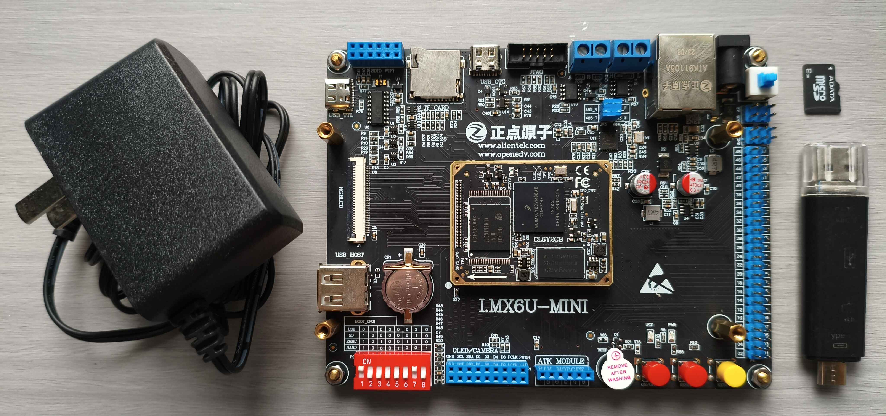
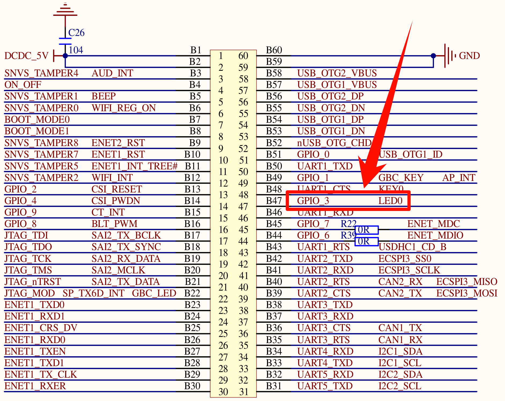
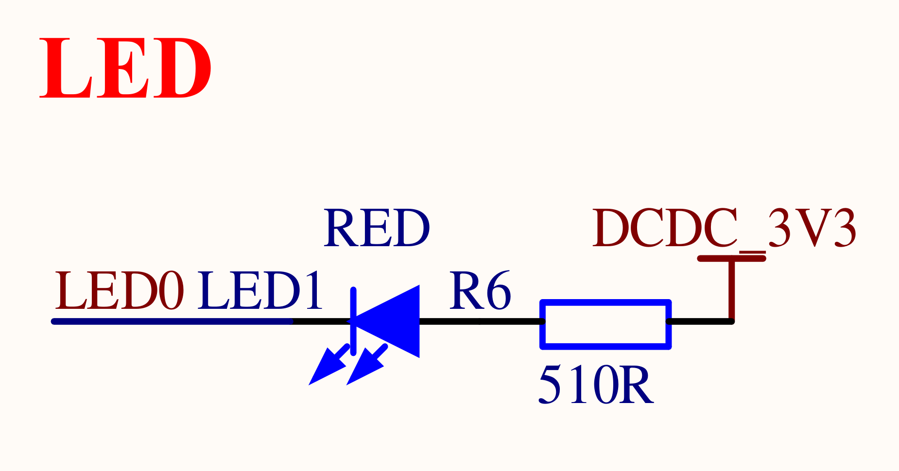
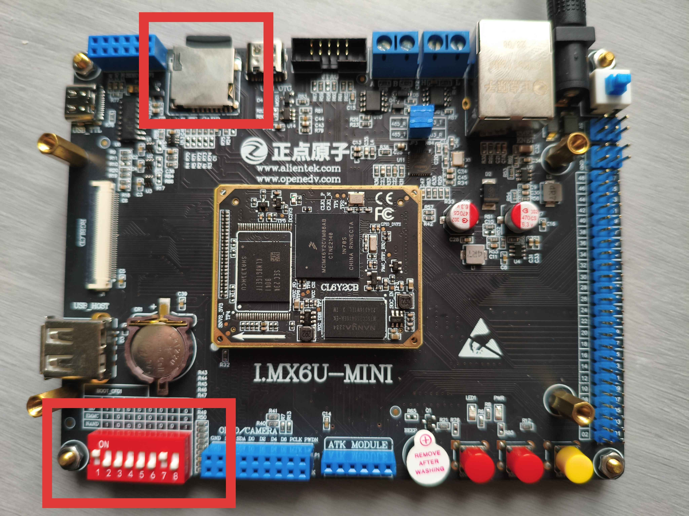
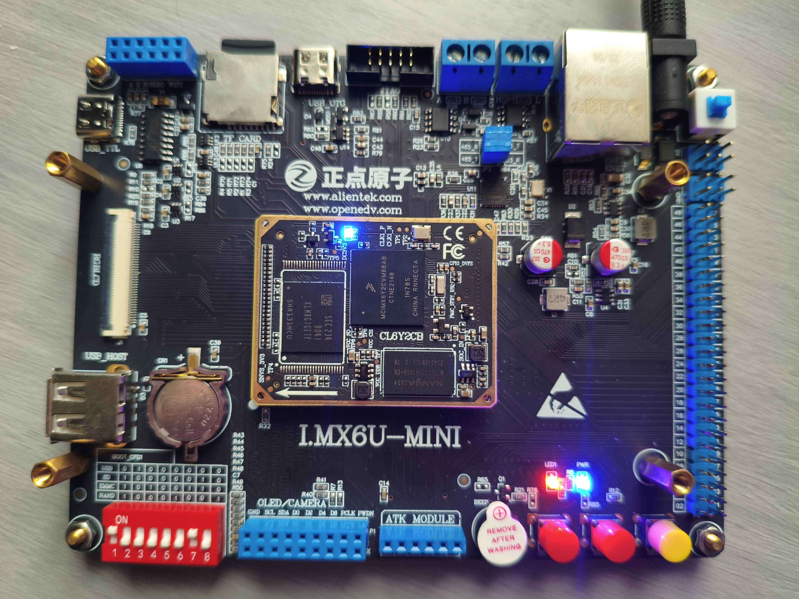

# 汇编 LED 驱动实验分析

## 实验目的

> LED0 为原理图中的编号，实际 PCB 板上的 LED 丝印为 LED1，下文使用名称 LED1 进行说明。

使用 GNU Assembly 编写汇编代码，烧录镜像到 TF 卡，驱动电路点亮 LED1。

## 实验环境与器材

### 实验环境

实验环境主要是指软件环境，本项目开发环境使用 Docker 配置，如果你还没有安装 Docker 请先安装 Docker。在项目根目录执行（如果你还没有执行过）：

```bash
docker build -t alientek-imx6ull:latest ./docker
```

在 Clion 中配置工具链为该镜像。

### 实验器材

| 名称                      | 数量 |
| :------------------------ | :--: |
| I.MX6ULL Mini 开发板 v2.2 |  1   |
| 12V 1A DC 电源            |  1   |
| 读卡器                    |  1   |
| TF 卡                     |  1   |

如下所示：



> [!NOTE]
>
> 建议不要使用我图中所示类型（三种接口）的读卡器，也可能是我已经用了四五年了，USB 口和 Type-C 口都接触不良，烧录非常折磨。

## 实验原理

LED 原理图如下：





从图上可以看出，LED1 连接到了 I.MX6ULL 的 GPIO_3，这里的 GPIO_3 就是 GPIO1_IO03。当 GPIO1_IO03 输出低电平（`0`）时，发光二极管 LED1左侧电势低于右侧电势（$0<3.3\text{V}$），电路导通，LED1 亮；当 GPIO1_IO03 输出高电平（`1`）时，发光二极管 LED1 两侧电势相等，电路不导通，LED1 灭。

所以 LED0 的亮灭取决于 GPIO1_IO03 的输出电平，输出 `0` 就亮，输出 `1` 就灭。

涉及到的寄存器地址为：

| 寄存器                             | 位域     | 地址         |
| ---------------------------------- | -------- | ------------ |
| `CCM_CCGR1`                        | [27, 26] | `0x020c406c` |
| `IOMUXC_SW_MUX_CTL_PAD_GPIO1_IO03` | 全部     | `0x020e0068` |
| `IOMUX_SW_PAD_CTL_PAD_GPIO1_IO03`  | 全部     | `0x020e02f4` |
| `GPIO1_GDIR`                       | 全部     | `0x0209c004` |
| `GPIO1_DR`                         | 全部     | `0x0209c000` |

## 实验步骤

### 编写 `main.s`

代码如下所示：

```assembly
.global _start @ 全局符号

/**
 * 定义与 GPIO1_IO03 相关的寄存器地址
 */
.equ CCM_CCGR1,                         0x020c406c
.equ IOMUX_SW_MUX_CTL_PAD_GPIO1_IO03,   0x020e0068
.equ IOMUX_SW_PAD_CTL_PAD_GPIO1_IO03,   0x020e02f4
.equ GPIO1_GDIR,                        0x0209c004 @ GPIO1 方向寄存器地址
.equ GPIO1_DR,                          0x0209c000 @ GPIO1 数据寄存器地址

_start: @ 程序入口
    /**
     * 1. 使能 GPIO1 时钟
     */
    ldr r0, =CCM_CCGR1
    ldr r1, =0xffffffff @ 0b00111100 00000000 00000000 # 使能 GPIO1 时钟
    str r1, [r0]

    /**
     * 2. 配置 GPIO1_IO03 为 GPIO 模式
     */
    ldr r0, =IOMUX_SW_MUX_CTL_PAD_GPIO1_IO03
    ldr r1, =0x5 @ 设置为 GPIO 模式
    str r1, [r0]

    /**
     * 3. 设置 GPIO1_IO03 为输出模式
     */
    ldr r0, =IOMUX_SW_PAD_CTL_PAD_GPIO1_IO03
    ldr r1, =0x10b0 @ 配置为输出模式，无上下拉，快速响应
    str r1, [r0]

    /**
     * 4. 设置 GPIO1_IO03 为输出模式
     */
    ldr r0, =GPIO1_GDIR
    ldr r1, =0x8 @ 设置 GPIO1_IO03（对应位3）为输出模式
    str r1, [r0] @ 写回 GPIO1 方向寄存器

    /**
     * 5. 点亮 LED（输出低电平）
     */
    ldr r0, =GPIO1_DR @ GPIO1 数据寄存器地址
    ldr r1, =0x0 @ 设置 GPIO1_IO03（对应位3）为低电平
    str r1, [r0] @ 写回 GPIO1 数据寄存器

loop:
    b loop @ 无限循环，保持 LED 点亮状态
```

### 编写 `CMakeLists.txt`

```cmake
cmake_minimum_required(VERSION 3.5)

project(led LANGUAGES C ASM)
set(CMAKE_ASM_COMPILER ${CMAKE_C_COMPILER})

add_executable(led main.s)
set_target_properties(led PROPERTIES
    LINK_FLAGS "-nostartfiles -Ttext=0x87800000"
    SUFFIX ".elf"
)

add_custom_command(TARGET led POST_BUILD
    COMMAND $ENV{CROSS_COMPILE}objcopy -O binary -j .text -j .data -j .rodata -S -g $<TARGET_FILE:led> ${CMAKE_BINARY_DIR}/led.bin
    COMMAND imxdownload ${CMAKE_BINARY_DIR}/led.bin led.imx
    COMMAND $ENV{CROSS_COMPILE}objdump -D $<TARGET_FILE:led> > ${CMAKE_BINARY_DIR}/led.dis
    COMMENT "Converting led.bin, led.imx and generating disassembly"
)
```

### 烧录镜像到 TF 卡

使用 USB Image Tool 软件烧录 `led.imx` 到 TF 卡。

### 运行镜像

将 TF 卡插入卡槽，将启动方式拨到 SD 方式启动，如下所示：



插入电源，点击电源旁的蓝色运行开关，大约 2s 后可以看到下方左侧第一个按键前的 LED1 亮起。

## 实验结果

如下所示：



## 结果分析与讨论

### 为什么在第一步使能时，写入 `0xffffffff`，而不是 `0x0c000000`？

在 I.MX6ULL 参考手册中，可以看到只有 `CCM_CCGR1` 的第 26 和 27 位是控制 GPIO1 的，如果只使能 GPIO1 的话，应该写入 `0x0c000000`，但是实际上写入这个数则不能达到实验结果，可能原因是 `CCM_CCGR1` 控制的外设中还有几个与时钟初始化有关系，具体是哪几个，我也不太知道，懒得查了，后面深入学习了再来解答这个问题。

### 为什么 `CMakeLists.txt` 中的命令比正点原子官方教程中的命令更加复杂？

正点原子官方 `Makefile` 如下：

```makefile
led.bin: led.s
    arm-linux-gnueabihf-gcc -g -c led.s -o led.o
    arm-linux-gnueabihf-ld -Ttext 0X87800000 led.o -o led.elf
    arm-linux-gnueabihf-objcopy -O binary -S -g led.elf led.bin
    arm-linux-gnueabihf-objdump -D led.elf > led.dis
clean:
	rm -rf *.o led.bin led.elf led.dis
```

与本项目的 `CMakeLists.txt` 的对应关系为：

| `Makefile`                    | `CMakeLists.txt`                               |
| ----------------------------- | ---------------------------------------------- |
| `arm-linux-gnueabihf-gcc`     | `add_executable()`                             |
| `arm-linux-gnueabihf-ld`      | `LINK_FLAGS "-Ttext=0x87800000" SUFFIX ".elf"` |
| `arm_linux_gnueabihf-objcopy` | `COMMAND $ENV{CROSS_COMPILE}objcopy`           |
| `arm_linux_gnueabihf-objdump` | `COMMAND $ENV{CROSS_COMPILE}objdump`           |

> [!NOTE]
>
> `CROSS_COMPILE` 是 `alientek-imx6ull` 镜像中内置的一个环境变量，其值为：`arm-linux-gnueabi-`。
>
> `$ENV{}` 是在 CMake 中使用系统环境变量的方法。

### 为什么不能使用正点原子提供的 `imxdownload` 烧录？

因为正点原子没有提供 `imxdownload` 的 Windows 下的可执行文件，虽然提供了源代码，但是其源代码是使用 Ubuntu 中的命令编写的，虽然可以在 Windows 下使用 gcc 编译成功，也无法正常执行。

而得益于 Linux 的虚拟文件系统，操作任何外设都相当于在操作文件，也就是说 `imxdownload` 将 `.bin` 写入 TF 卡，也就相当于它在写入一个文件，所以这里可以直接将设备名修改为 `led.imx`，然后在 Windows 中使用相关软件将这个 `.imx` 写入 TF 卡中。

## 结论与心得

1. 菜就多练
2. 多看手册
